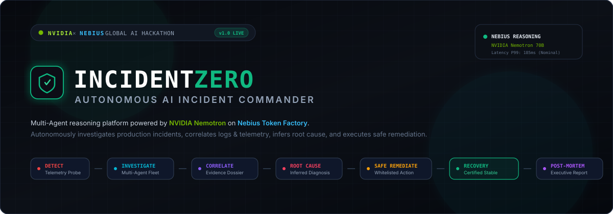
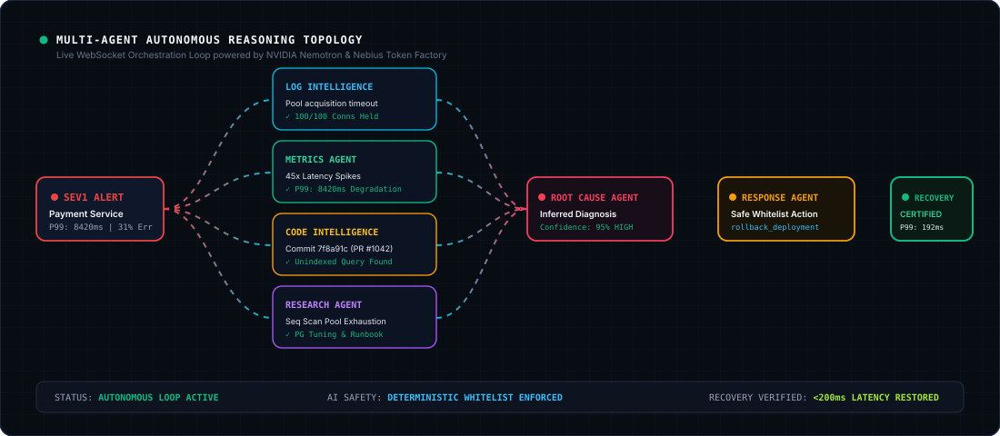

<div align="center">

<!-- Animated Hero Banner -->


<br/><br/>

<!-- Animated Terminal Header -->


<br/>

[](LICENSE)
[](https://build.nvidia.com/)
[](https://nebius.com/)
[](https://fastapi.tiangolo.com/)
[](https://react.dev/)
[](backend/tests/)

<p align="center">
  <b>Built for the NVIDIA × Nebius Global AI Hackathon</b>
  <br />
  <i>An autonomous multi-agent operational platform that detects, investigates, diagnoses, and safely remediates production outages across microservices.</i>
</p>

[Live Demo](#-demo-walkthrough) • [Multi-Agent Topology](#-multi-agent-topology) • [AI Safety](#-ai-safety--deterministic-execution) • [Quick Start](#-quick-start) • [Architecture](docs/architecture.md)

---

</div>

## 🌟 The IncidentZero Vision

In mission-critical production environments, incident triage is hindered by telemetry sprawl: fragmented application logs, degraded metric counters, unindexed database scans, and breaking Git commits across distributed microservices.

**IncidentZero** solves this by dispatching an autonomous fleet of specialized AI agents coordinated by an **Incident Commander**. 

Instead of waiting for an on-call engineer at 3 AM to piece together an outage, IncidentZero:
1. **Detects** telemetry degradation in real-time via automated health probes.
2. **Dispatches** 4 parallel forensic agents (Logs, Metrics, Git Commits, Technical Research).
3. **Correlates** an evidence dossier with confidence ratings.
4. **Infers** the singular underlying root cause (grounded strictly in telemetry, not pre-labeled flags).
5. **Formulates** a safe remediation plan constrained to an explicit whitelist.
6. **Executes** the remediation inside a sandboxed simulation environment.
7. **Audits** before-and-after telemetry to verify that latencies and error rates have returned to baseline.
8. **Generates** an executive post-mortem incident report.

---

## ⚡ Multi-Agent Topology & Live Orchestration

<div align="center">
  <!-- Animated Multi-Agent Flow Diagram -->
  
</div>

<br/>

### Specialized Forensic Agents with Typed Pydantic Contracts:

| Specialized Agent | Role & Domain | Input Telemetry | Pydantic Contract Output |
| :--- | :--- | :--- | :--- |
| **Incident Commander** | Top-level Orchestrator & State Machine | Outage alerts, environment state | State transitions, WebSocket broadcast, Post-Mortem Report |
| **Log Intelligence Agent** | Log Anomaly & Cascade Detection | Distributed microservice logs | `LogAnalysisResult` (anomalies, suspect errors, affected services) |
| **Metrics Agent** | Telemetry & Saturation Evaluator | Latency P99/P50, error rates, CPU/RAM | `MetricsAnalysisResult` (P99 impact, error spike %, pool saturation) |
| **Code Intelligence Agent** | Git Commits & Code Diff Inspector | Commits, diffs, PR messages, author | `CodeAnalysisResult` (regressions, culprit flag, risk rating) |
| **Research Agent** | Failure Pattern & Runbook Research | Error signatures, symptoms | `ResearchResult` (query, sources, findings, recommendations) |
| **Root Cause Agent** | Multi-Source Evidence Synthesizer | Correlated Evidence Dossier | `RootCauseDiagnosis` (diagnosis title, probable root cause, suspect service) |
| **Response Agent** | Safe Remediation Strategist | Root Cause Diagnosis | `RemediationPlan` (whitelisted action, risk, rollback contingency) |
| **Recovery Verification Agent** | Telemetry Health Auditor | Baseline, Incident, and Post metrics | `RecoveryVerificationResult` (is_recovered, latency delta, certification) |

---

## 🤖 NVIDIA & Nebius Token Factory Integration

IncidentZero makes **real runtime calls** to **Nebius Token Factory** powering open-source **NVIDIA Nemotron** models:

- **Primary Model:** `nvidia/Llama-3.1-Nemotron-70B-Instruct-HF`
- **Clean Architecture:** `backend/app/ai/provider.py` abstracts all reasoning calls.
- **Configurable Environment:** Loaded via `NEBIUS_API_KEY`, `NEBIUS_MODEL`, and `NEBIUS_API_BASE_URL`.
- **Honest State Handling:** If credentials are not supplied, the interface clearly shows **"AI provider not configured"** instead of pretending to work or returning fake mock text.
- **Deterministic Test Engine:** An isolated deterministic provider is enabled for automated unit and E2E CI tests.

---

## 🛡️ AI Safety & Deterministic Execution

In SRE and production operations, letting an LLM execute arbitrary shell scripts or code is unacceptable. IncidentZero enforces a strict architectural boundary:

```
┌─────────────────────────────────┐        ┌──────────────────────────────────┐
│        AI REASONING LAYER       │        │  DETERMINISTIC EXECUTION LAYER   │
│  Response Agent recommends:     │ ─────> │  - Validates action in whitelist │
│  "rollback_deployment"          │        │  - Validates authorized service  │
│  (Pure proposal, no execution)  │        │  - Executes sandboxed operation  │
└─────────────────────────────────┘        └──────────────────────────────────┘
```

### Whitelisted Actions:
- `rollback_deployment`: Rolls back the target service container to the previous stable release artifact.
- `restart_service`: Performs a rolling restart of worker pods to flush corrupted heap memory or thread pools.
- `restore_previous_configuration`: Reverts runtime configuration flags to known-good baseline values.

---

## 🎮 Realistic 5-Microservice Simulator

Simulates an interconnected production microservices mesh:
- **API Gateway:** Ingress routing, client timeouts, HTTP 504 tracking.
- **Payment Service:** Core transaction ledger and payment processing worker.
- **User Service:** Account history synchronization.
- **Database:** Primary PostgreSQL cluster with connection pool limits (100 active).
- **Monitoring System:** Synthetic telemetry, latency counters, and alerting daemon.

### Injected Outage Scenarios:
<details open>
<summary><b>1. Database Query Regression (SEV1)</b></summary>
<br/>
Deployment PR #1042 introduced an unindexed nested query on payment audit records. Saturated all 100 postgres connections, causing P99 latency to spike from 185ms to 8420ms with 31% HTTP 504 timeouts across the API Gateway.
<br/><i>Remediation:</i> <code>rollback_deployment</code>
</details>

<details>
<summary><b>2. Memory Saturation & OOMKilled Crashes (SEV1)</b></summary>
<br/>
Deployment PR #1055 introduced an unbounded in-memory telemetry buffer. Memory escalated to 96%, triggering recurring container OOM terminations (exit code 137) and 502 Bad Gateway responses.
<br/><i>Remediation:</i> <code>restart_service</code>
</details>

<details>
<summary><b>3. Service Dependency Failure & Timeout Cascade (SEV2)</b></summary>
<br/>
Configuration update disabled the circuit breaker and raised fraud evaluation timeouts to 30 seconds. Downstream partner slowdown starved all worker threads.
<br/><i>Remediation:</i> <code>restore_previous_configuration</code>
</details>

---

## 🚀 Quick Start

### 1. Prerequisites
- Python 3.11+
- Node.js 20+ & npm
- Nebius Token Factory API Key (Optional for offline test mode)

### 2. Local Setup
```bash
# Clone the repository
git clone https://github.com/ASTA91-GIT/Nvidia-Hackathon.git
cd Nvidia-Hackathon

# Configure environment variables
cp .env.example .env
```

Add your Nebius Token Factory credentials to `.env`:
```ini
NEBIUS_API_KEY=your_nebius_api_key_here
NEBIUS_MODEL=nvidia/Llama-3.1-Nemotron-70B-Instruct-HF
NEBIUS_API_BASE_URL=https://api.tokenfactory.nebius.com/v1
```

### 3. Start Backend
```bash
# Create virtual environment
python -m venv backend/.venv

# Activate virtual environment
# Windows:
backend\.venv\Scripts\activate
# Linux/macOS:
source backend/.venv/bin/activate

# Install dependencies
pip install -r backend/requirements.txt

# Run FastAPI with WebSockets
uvicorn backend.app.main:app --host 0.0.0.0 --port 8000 --reload
```
API runs on `http://localhost:8000` (Interactive Swagger at `http://localhost:8000/docs`).

### 4. Start Command Center Frontend
```bash
cd frontend
npm install --legacy-peer-deps
npm run dev
```
Open `http://localhost:5173` in your browser.

---

## 🐳 Docker Deployment

Run both backend and frontend with a single command:
```bash
docker compose up --build
```
- **Frontend Dashboard:** `http://localhost:3000`
- **Backend API:** `http://localhost:8000`

---

## 🧪 Comprehensive Test Suite

IncidentZero comes with unit, agent schema, safety whitelist, and end-to-end integration tests:

```bash
# Run full test suite with pytest
backend/.venv/Scripts/python -m pytest backend/tests/ -v
```

```
backend/tests/test_api.py::test_root PASSED [ 10%]
backend/tests/test_api.py::test_system_health PASSED [ 20%]
backend/tests/test_api.py::test_list_scenarios PASSED [ 30%]
backend/tests/test_api.py::test_create_and_get_incident PASSED [ 40%]
backend/tests/test_simulator.py::test_trigger_incident_creates_telemetry PASSED [ 50%]
backend/tests/test_simulator.py::test_remediation_whitelist_validation PASSED [ 60%]
backend/tests/test_simulator.py::test_remediation_execution_and_metrics_recovery PASSED [ 70%]
backend/tests/test_agents.py::test_log_intelligence_agent PASSED [ 80%]
backend/tests/test_agents.py::test_root_cause_agent PASSED [ 90%]
backend/tests/test_e2e.py::test_full_autonomous_investigation_e2e PASSED [100%]

======================= 10 passed in 1.10s =======================
```

---

## 🎬 Demo Walkthrough

1. Open the **System Operations Dashboard** (`http://localhost:5173`).
2. Click the glowing **"SIMULATE INCIDENT"** button.
3. Select **"Database Query Regression"** and ensure *Auto-Dispatch Multi-Agent Investigation* is enabled.
4. Watch the **Interactive Multi-Agent Graph (React Flow)** update in real time with animated status pulses.
5. Inspect the **Telemetry Charts (Recharts)** showing P99 latency spiking over 8000ms.
6. Review the **Forensic Evidence Dossier** and **Live Raw Logs Terminal**.
7. Examine the **Root Cause Diagnosis** inferred by the Root Cause Agent.
8. Click **"Execute Safe Remediation"** to trigger the whitelisted `rollback_deployment`.
9. Watch the **Recovery Verification Agent** certify nominal baseline restoration (&lt;200ms latency).
10. Review and print the authoritative **Post-Mortem Incident Report**.

---

## 📄 License

This project is licensed under the MIT License - see the [LICENSE](LICENSE) file for details.
