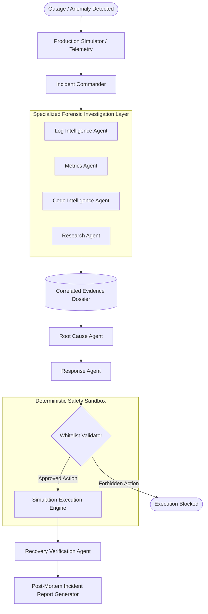

# INCIDENTZERO: Technical Architecture & System Design

**Autonomous AI Incident Commander for Production Environments**  
*Built for the NVIDIA × Nebius Global AI Hackathon*

---

## 1. System Overview

IncidentZero is an autonomous AI incident response platform engineered to investigate, diagnose, and remediate simulated and production outages. It replaces static alerting dashboards with a coordinated multi-agent system governed by an **Incident Commander**.

---

## 2. Multi-Agent Topology & Responsibilities

Each agent in IncidentZero operates under strict contract boundaries with Pydantic-validated input and output schemas:

| Agent | Responsibility | Core Data Inputs | Structured Contract Output |
| :--- | :--- | :--- | :--- |
| **Incident Commander** | Top-level workflow orchestrator & state manager | Incident trigger, telemetry data, lifecycle state | State transitions, WebSocket broadcasts, final report |
| **Log Intelligence Agent** | Parses service logs, stack traces, and error cascades | Multi-service timestamped log streams | `LogAnalysisResult` (anomalies, suspect errors, affected services) |
| **Metrics Agent** | Evaluates P99/P50 latencies, error spikes, and saturation | Telemetry snapshots (baseline vs incident) | `MetricsAnalysisResult` (P99 impact, error spike %, pool saturation) |
| **Code Intelligence Agent** | Analyzes recent deployments, commits, and git diffs | Commit sha, author, diff summary, code patch | `CodeAnalysisResult` (regressions, culprit flag, risk rating) |
| **Research Agent** | Researches architectural failure modes & runbooks | Symptoms, error signatures, external knowledge | `ResearchResult` (query, sources, findings, recommendations) |
| **Root Cause Agent** | Synthesizes multi-source evidence to infer root cause | Correlated Evidence Dossier | `RootCauseDiagnosis` (diagnosis title, probable root cause, suspect service) |
| **Response Agent** | Formulates whitelisted, safe remediation strategy | Root Cause Diagnosis, target service | `RemediationPlan` (action_type, parameters, risk, contingency) |
| **Recovery Verification Agent** | Audits before-and-after telemetry to verify recovery | Baseline, incident, and post-remediation metrics | `RecoveryVerificationResult` (is_recovered, latency delta, certification) |

---

## 3. AI Safety & Whitelist Execution Layer

In SRE and production operations, allowing an LLM to generate arbitrary Bash commands, SQL migrations, or delete files is unacceptable. IncidentZero implements a strict separation between **AI reasoning** and **deterministic tool execution**:

1. **AI Proposes:** The Response Agent recommends an action from an explicit enum (`rollback_deployment`, `restart_service`, `restore_previous_configuration`).
2. **Backend Validates:** The deterministic backend verifies:
   - Is `action_type` in `ALLOWED_REMEDIATION_ACTIONS`?
   - Is `target_service` authorized for this action?
   - Are parameters properly bounded?
3. **Execution Sandbox:** Only validated, authorized actions are executed by the simulator or target cluster.
4. **Verification Loop:** System does not declare victory immediately. The Recovery Agent compares fresh telemetry against historical baselines before resolving the incident.

---

## 4. NVIDIA & Nebius Token Factory Integration

IncidentZero uses **Nebius Token Factory** to access open-source NVIDIA foundation models, specifically **NVIDIA Nemotron** (`nvidia/Llama-3.1-Nemotron-70B-Instruct-HF`).

- **Decoupled Provider Architecture:** Implemented in `backend/app/ai/provider.py` via `AIProvider` base class.
- **Configurable Runtime:** Configured via `NEBIUS_API_KEY`, `NEBIUS_MODEL`, and `NEBIUS_API_BASE_URL`.
- **Honest Configuration State:** If credentials are not present, IncidentZero displays a clear "AI provider not configured" status rather than generating fake or mocked responses.
- **Deterministic Testing:** An explicit `TEST_MODE` provider is available for test environments to verify agent contracts without network calls.

---

## 5. Microservices Simulator

The simulation environment mimics 5 enterprise services:
- **API Gateway:** Reverse proxy handling inbound client traffic, routing, and HTTP timeouts.
- **Payment Service:** Core transaction and audit processing engine.
- **User Service:** Account profile and transaction history synchronization.
- **Database:** Primary PostgreSQL cluster with connection pooling (max 100).
- **Monitoring System:** Synthetic telemetry, Prometheus latency counters, and alert manager.

### Included Scenarios:
1. **Database Query Regression:** Deployment PR #1042 introduced an unindexed sequential scan on payment audit records, exhausting all 100 DB pool connections and escalating P99 latency from 185ms to 8420ms with 31% HTTP 504 timeouts. (Remediation: `rollback_deployment`)
2. **Memory Leak:** PR #1055 introduced an unbounded in-memory telemetry buffer causing JVM/worker heap saturation, recurring OOMKilled exits (exit code 137), and gateway 502 errors. (Remediation: `restart_service`)
3. **Service Dependency Timeout:** Configuration change increased downstream fraud gateway timeout to 30s and disabled the circuit breaker, causing worker thread starvation. (Remediation: `restore_previous_configuration`)
